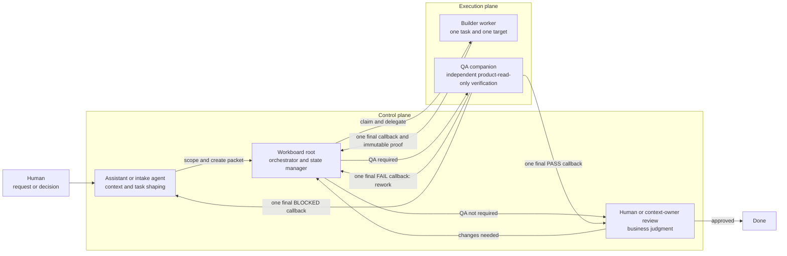

# Workboard Starter

A lightweight repo-based queue for coordinating agent work across local orchestrators and parallel worker threads.

Use it when your team has multiple projects, multiple agents, or long-running work that needs proof instead of vibes.

## What this is

Workboard is a shared filesystem/Git protocol:

1. Write a task packet in `tasks/ready/`.
2. A root orchestrator claims eligible work into `tasks/claimed/`.
3. The orchestrator delegates each packet to a correctly-scoped worker thread/project.
4. Each worker sends the persistent root task one final callback with immutable proof and the exact next lane.
5. Work that requires independent verification moves to `tasks/qa/` and a separate QA companion returns `PASS`, `FAIL`, or `BLOCKED`.
6. QA-passed work, or work that does not require QA, moves to `tasks/review/`.
7. A human or context owner checks the verified outcome and moves it to `tasks/done/`.

It does not require OpenClaw. It works with Codex Desktop, Claude Desktop, Claude Code, Codex CLI, OpenClaw, or any local agent that can read files, run commands, and use Git.

Portable routing defaults root orchestration, implementation, documentation,
tests, and routine QA to `gpt-5.6-sol` with medium reasoning. Packet overrides
take precedence over project overrides, which take precedence over the portable
default. High reasoning requires one of four machine-recognized task categories:
`high_stakes`, `security_sensitive`, `repeatedly_blocked`, or
`unusually_complex`. `gpt-5.6-luna` requires exact `bounded_high_volume`
eligibility and independent verification.

This release declares Workboard protocol `1.0.1`. The portable capability
inventory is `workboard-capabilities.json`; validate it with
`node scripts/check-workboard-capabilities.mjs --repo "$PWD"`. It records the
last synchronized starter release or commit and distinguishes supported
features from tracked but unimplemented work.

## How the roles fit together



These are responsibility boundaries, not necessarily different vendors or models. Keep each role in a separate task with the minimum context and permissions it needs:

- the assistant understands intent and business context;
- the root orchestrator owns queue state and routing;
- the builder changes one target project;
- the QA companion verifies fresh evidence without fixing or trusting the builder's conclusion;
- the human or context owner makes the final judgment.

## Why use it

Chat threads are bad source-of-truth. Workboard gives you:

- visible queue state;
- safe handoffs between humans and agents;
- parallel workers without losing the plot;
- per-target duplicate prevention without blocking unrelated work;
- proof requirements before “done”;
- blockers that survive context resets;
- a simple Git audit trail.

## Quick start

For a new organization or named orchestrator deployment, start with
[`docs/new-workboard-initialization.md`](docs/new-workboard-initialization.md).
It explains whether to fork or create an independent repository, separates the
root controller from local operator responsibilities, and requires a harmless
first-task dispatch smoke before recurring polling is enabled.

```bash
git clone <YOUR_WORKBOARD_REPO_URL> workboard
cd workboard
cp projects.example.yaml projects.yaml
mkdir -p tasks/{ready,claimed,qa,blocked,review,done}
git add projects.yaml tasks/*/.gitkeep
git commit -m "Configure local workboard"
```

Edit `projects.yaml` with your local project paths and the agent surface you use for each project.

Then copy the template:

```bash
cp templates/task-packet.md tasks/ready/$(date +%Y-%m-%d)-001-example-task.md
```

Fill it in, commit, push, and let your orchestrator run the loop.

## The mental model

The root orchestrator is air traffic control. It should:

- inspect the board;
- claim only safe, independent tasks;
- route each task to the right worker/project;
- treat active work as per-target locks;
- reconcile one-shot completion callbacks;
- record proof;
- stop at blockers.

Workers are pilots. Each worker gets one packet, one target path, and clear proof requirements.

Ordinary polls never inspect, monitor, heartbeat, or babysit active task history.
Claimed and active-QA packets consume capacity and lock their exact decoded
`target_project_id` + `target_path` tuple. Ready work for other targets keeps
routing up to capacity. Every builder and QA create handoff receives the persistent source
`root_task_id` and current `worker_creation_attempt_id`, but no future task ID.
Complete live readback writes canonical `worker_thread_id`; the task then sends exactly one final callback. Only a
callback matching the packet's current task and attempt can route; delayed or
noncanonical callbacks are recovery evidence. The callback gate also requires
source `worker_creation_status: canonical` and `completion_callback_status: pending` after structural duplicate-key
rejection. Callback failure emits
`ROOT_RECONCILIATION_REQUIRED` with the same immutable proof and attempt ID.

QA companions are inspectors. They run as separate `[qa] <short label>` tasks inside the existing target project. They get the acceptance criteria, a pinned commit or immutable artifact, the required verification tools, and a local artifact directory. They report `PASS`, `FAIL`, or `BLOCKED`; they do not quietly fix the builder's work.

Do not turn the root orchestrator into a roaming implementation agent. That is how boards become soup.

## Repo layout

```text
docs/
  orchestrator-protocol.md  # standing instructions for the root loop
  dependency-promotion.md   # promotion metadata and bounded root workflow
  task-packet-schema.md     # v2 metadata, transitions, validation, migration
  intake-guide.md           # how to write packets
  automation-examples.md    # Codex/Claude/OpenClaw patterns
  new-workboard-initialization.md # repo, controller, automation, and smoke setup
  github-codex-review-gate.md # exact-head hosted review and rework gate
  live-task-visibility.md   # app-native proof and portable fallback
  codex-task-finalization.md # optional local Codex task hygiene
  known-issues-and-recovery.md # operator symptoms, stops, evidence, recovery
  upstream-synchronization.md # production-derived upgrade and release gate
  pending-improvements.md   # production hardening backlog for the starter
  releases/                 # compatibility, migration, and adoption records
CONTRIBUTING.md              # contribution workflow and portability boundary
RELEASE.md                   # release checklist
ORCHESTRATOR.md              # first file for the local root orchestrator
scripts/
  check-workboard-git-preflight.mjs # root-owned Git status/fetch/ff-only gate
  check-workboard-queue.mjs # read-only local queue classifier
  classify-codex-task-finalizer.mjs # read-only task-hygiene candidates
  check-workboard-target-lock.mjs # exact decoded target-lock check
  check-workboard-callback.mjs # canonical callback status/identity/role/lane check
  check-task-packet.mjs # fail-closed packet schema and lifecycle validator
  check-task-creation-recovery.mjs # validate recovery state and proof
  check-workboard-closeout.mjs # validate state-first title and task-link proof
  reconcile-task-creation-recovery.mjs # write canonical worker and gate callbacks
  check-upstream-sync.mjs # validate synchronized production-derived upgrades
skills/
  workboard-orchestrator/    # optional portable skill instructions
templates/
  task-packet.md            # copy this into tasks/ready/
  task-creation-recovery.md # reconcile ambiguous app-native creation
  local-operator-setup.md   # private local project and automation handoff
  workboard-initialization-record.md # durable first-smoke and activation proof
  upstream-sync-record.md # compatibility/migration/adoption record
tasks/
  backlog/                  # valid work not yet eligible to claim
  ready/                    # ready to claim
  claimed/                  # active work
  qa/                       # implementation-complete, independent QA pending/active
  blocked/                  # blocked with reason/proof
  review/                   # QA-passed or QA-not-required, final review pending
  done/                     # verified complete
  archive/                  # terminal archived packets with reason/proof
projects.example.yaml       # copy to projects.yaml and customize
tests/
  check-workboard-callback.test.mjs
  check-task-packet.test.mjs
  check-workboard-queue.test.mjs
  check-workboard-target-lock.test.mjs
  codex-task-finalizer.test.mjs
  live-task-visibility-docs.test.mjs
  task-creation-recovery.test.mjs
  workboard-closeout.test.mjs
```

## Root Git preflight

Before queue classification, run the dependency-free root synchronization gate:

```bash
node scripts/check-workboard-git-preflight.mjs --repo "$PWD"
```

The requested path is canonicalized first and must exactly equal Git's canonical
top-level directory. Symlink and `..` aliases are accepted only when they resolve
to that same root; nested repository directories are rejected explicitly. It
then inspects branch and status, fetches `origin/main`, and fast-forwards only when
the checkout is clean `main` and strictly behind. Continue only for
`GIT_PREFLIGHT_STATUS=READY` or `GIT_PREFLIGHT_STATUS=UPDATED`. Dirty,
conflicted, non-main, ahead, diverged, fetch/auth/network, and failed
fast-forward states return `GIT_PREFLIGHT_STATUS=STOP` without queue reads.
Use `--remote <name>` when the intended remote is not `origin`; the intended
branch remains `main`. Before a fast-forward and again before reporting success,
the gate revalidates the branch, conflict state, exact `HEAD` and `FETCH_HEAD`,
and full tracked/untracked status. A concurrent change fails closed.

The gate coordinates root processes with an atomic directory at
`<git-common-dir>/workboard-root-preflight.lock/`. It acquires the lock after
repository discovery but before branch, status, or fetch inspection, holds it
through synchronous `READY`, `UPDATED`, or `STOP` emission, and removes its own
lock immediately afterward. A competing compliant root stops. Existing locks,
regardless of age, are never auto-expired or auto-removed; follow the explicit
recovery procedure in `docs/orchestrator-protocol.md`.

This is cooperative exclusion, not compare-and-swap over the Git checkout. It
cannot stop an uncooperative external process from changing refs or files after
the final observation. Keep one root writer per Workboard checkout.

Git commands run as interruptible child process groups. `SIGHUP`, `SIGINT`, or
`SIGTERM` latches an interruption, terminates the active Git group, suppresses
`READY`/`UPDATED`, emits `STOP REASON=INTERRUPTED` with the signal, cleans the
owned lock, and exits nonzero.

## Queue-first check

Before loading project registries, packet bodies, or task history, run the
dependency-free classifier:

```bash
node scripts/check-workboard-queue.mjs --repo "$PWD" --capacity 3
```

It does not invoke Git, move packets, create directories, or write inside the
Workboard repository. It reports local queue counts, claimed and active-QA
target locks, completed QA results, configured/available capacity, and one
routing status. Capacity defaults to 3; at capacity it reports
`WORK_IN_PROGRESS` even when ready work is waiting. As an independent path
identity guard, it canonicalizes `--repo` and requires a real root `.git` file or
directory; this rejects nested paths while keeping Git synchronization and
judgment exclusively in the preflight.

Scheduled polls can opt into a strict one-line state file outside the repo:

```bash
node scripts/check-workboard-queue.mjs \
  --repo "$PWD" \
  --run-memory "$HOME/.local/state/workboard/poll.json" \
  --idle-pause-threshold 4 \
  --idle-pause-action recommend
```

Create the external parent directory during automation setup; the classifier
creates and atomically replaces only the state file.

Stable `NOTHING_TO_CLAIM` and claimed-only `WORK_IN_PROGRESS` snapshots increment
`NO_ACTION_STREAK`. A changed queue signature or any actionable lane resets it.
At the threshold, `recommend` emits a recommendation; `pause` emits
`IDLE_PAUSE_REQUESTED=1` for the host automation controller to execute and verify.
Ready or pending-QA inventory never requests a pause. The memory file contains
only version, outcome, hashed queue signature, streak, and timestamp; malformed,
multiline, oversized, symlinked, or in-repo memory fails closed.

After an outcome is known, Codex operators may run the optional read-only task
finalizer described in [`docs/codex-task-finalization.md`](docs/codex-task-finalization.md).
It accepts only explicitly named local rollout files and exact configured
automation ID/name pairs, emits bounded state-first candidates, and leaves every mutation
and readback to app-native task tools. It does not scan private session roots,
read a Codex database, or hard-delete task rows.
Its output is canonical `codex-task-finalizer/v1` JSONL: strict parsing yields
raw task IDs/titles/actions, and encoded or serialized wire text must never be
used as an app-native title.

Run the tests with:

```bash
node --test tests/*.test.mjs
```

## Upstreaming Production-Derived Upgrades

Operational improvements must be generalized without copying host-specific
state. Update the protocol, portable skill, task packet template, automation
examples, focused tests, and one compatibility/migration record together. The
record links each customized clone's adoption back to the originating public
starter issue or release; no fork relationship or remote naming convention is
required.

Follow [`docs/upstream-synchronization.md`](docs/upstream-synchronization.md),
then validate the actual change set against an explicit local base ref:

```bash
node scripts/check-upstream-sync.mjs \
  --repo <WORKBOARD_STARTER_ROOT> \
  --base <LOCAL_BASE_REF> \
  --record docs/releases/<UPGRADE_RECORD>.md
```

The check rejects incomplete synchronization, missing compatibility or migration
impact, absent adoption backlinks, and newly introduced host-specific paths,
identifiers, private identity values, credentials, or local persistence
assumptions. See [`CONTRIBUTING.md`](CONTRIBUTING.md) and
[`RELEASE.md`](RELEASE.md) for the contributor and release checklists.

The ST-013 gate also requires a changed, valid capability manifest. Follow
[`docs/capability-manifest.md`](docs/capability-manifest.md) to reconcile clone
status, set the portable starter release or commit coordinate, refresh evidence
digests, and inspect the manifest diff before running the upstream gate.

When ready work and active locks coexist, check each candidate with:

```bash
node scripts/check-workboard-target-lock.mjs \
  --target-project-id "$TARGET_PROJECT_ID" \
  --target-path "$TARGET_PATH" \
  --claimed-locks "$CLAIMED_LOCKS" \
  --qa-active-locks "$QA_ACTIVE_LOCKS"
```


## Packet metadata and validation

New packets use the normalized `packet_schema_version: 2` contract in
`templates/task-packet.md`. It carries dependency and promotion metadata, exact
target lock ownership, immutable execution and QA targets, resolved root/worker/
QA routing, dispatch and callback provenance, creation/visibility/recovery
state, durable QA artifact locations, prior QA continuation proof, publication
receipts, and archive reason.

Every move appends an explicit `backlog`, `ready`, `active`, `qa`, `blocked`,
`review`, `done`, or `archive` transition record. Validate before intake and
before each move:

```bash
node scripts/check-task-packet.mjs <PACKET> \
  --lane <DESTINATION_LANE> --previous-status <CURRENT_LOG_STATE>
```

The check rejects missing, unknown, duplicate, or incompatible state metadata;
malformed or partial transition logs; noncanonical IDs and commit SHAs;
unsupported routes; invalid callbacks, QA paths, or typed receipts;
secret-shaped content; and user-specific absolute paths anywhere in the packet.
Legacy packets are read-only compatible only through an
explicit `--allow-legacy` run; migrate them to v2 before mutation. See
`docs/task-packet-schema.md`.

## Tool requirements in task packets

When a task needs browser automation, computer use, Google Drive/Docs, screenshots, or another plugin/skill, declare it in the packet metadata instead of hoping the worker remembers.

Supported fields in `templates/task-packet.md` include:

- `requires_browser`
- `requires_computer_use`
- `requires_google_drive`
- `requires_google_docs`
- `requires_screenshot`
- `required_skills`
- `qa_required`
- `qa_status`
- `backlog_reason`, dependency/promotion fields, and exact target-lock fields
- `target_commit`, generic and QA immutable targets, and prior QA head/result
- `dispatch_mode`, exact live creation surface, callback source/handoff and typed pinned-target proof fields, and repository-associated publication receipts
- `github_pr`, `github_issue`, `root_task_id`, and canonical `worker_thread_id`
- worker task title, creation surface/attempt ID, portable session ID, link, host identity, visibility status/proof, recovery status/pending, callback envelope, and routing blocker fields
- `qa_publish_to_github`, `qa_worker_notification_policy`, and publication receipt fields
- `qa_codex_project`
- `qa_model`
- per-role model, reasoning, `*_model_routing_reason_category`, and optional `*_model_routing_reason_note`
- per-role `*_luna_eligibility` and `*_independent_verification` fields
- `qa_artifacts_dir`
- `qa_thread_id`
- `qa_result`
- persistent `root_task_id`, canonical `worker_thread_id`, and per-creation `worker_creation_attempt_id`
- completion callback task/attempt identity, receipt, and error fields

The orchestrator must preflight these before delegation and require proof before routing the packet to `tasks/qa/` or `tasks/review/`.

Validate packet/project routing overrides with
`scripts/check-model-routing.mjs`. It resolves packet, project, and portable
sources in order, rejects unreasoned high escalation, and rejects Luna routes
without exact `bounded_high_volume` eligibility and independent verification.
Unknown, duplicate, missing-value, and misspelled CLI options fail closed.

## Ambiguous task creation

An app-native task-creation timeout may happen after persistence. Do not retry it
as if it were a confirmed failure. Keep the packet claim and target lock, copy
`templates/task-creation-recovery.md`, and use live app-native list/read to find
the original, authorize a replacement only when the original is proven absent or
unusable, and select one canonical task. Archive or stand down only proven
duplicates; preserve their history.

Validate a filled recovery packet with:

```bash
node scripts/check-task-creation-recovery.mjs <RECOVERY_PACKET>
```

Recovery completion records and reruns both dependency promotion and queue
classification before routing resumes. The full checklist is in
`docs/orchestrator-protocol.md`. Recovery records distinguish a verified
`canonical_worker` from a conclusively proven `no_usable_worker`; only the
latter permits a blocked transition and lock release without canonicalization.

For external platform and environment failures beyond creation ambiguity, use
`docs/known-issues-and-recovery.md`. Each record maps symptoms and impact to a
bounded safe response, forbidden shortcuts, evidence, and the existing portable
mitigation contract. This includes the optional RTK wrapper contract: prove the
plain executor first, fall back for the run when RTK is unavailable, and never
retry an ambiguous mutation automatically.

Dependency promotion uses the bundled read-only frontmatter scanner:

```bash
node scripts/check-workboard-promotions.mjs --repo <WORKBOARD_PATH>
```

Root owns the resulting queue transition. See `docs/dependency-promotion.md` for
portable packet metadata, policy semantics, output encoding, and bounded review.

## Minimum rules

- No secrets in this repo.
- No raw private memory dumps.
- One root orchestrator loop at a time.
- Default max active claimed or active-QA tasks: 3.
- One worker per packet.
- Claimed and active-QA packets lock only their exact target tuple; unrelated targets continue up to capacity.
- Active workers are event-driven: no periodic history reads, monitoring, or heartbeats.
- Each builder/QA task sends exactly one final callback to persistent `root_task_id`. Only callback `worker_task_id` matching canonical `worker_thread_id` and matching `worker_creation_attempt_id` can route; noncanonical callbacks are recovery evidence. Callback failure emits `ROOT_RECONCILIATION_REQUIRED`.
- A task-creation timeout is ambiguous; no replacement is allowed without live app-native absence or unusability proof.
- QA runs in a separate task and does not inherit the builder's conclusions as truth.
- Every task title starts with its current Workboard state, including `[claimed]`, `[qa]`, `[review]`, and `[blocked]`.
- Root closeout titles are applied only after the final outcome is known, use `[idle|claimed|qa|review|blocked|done] <useful project or task label>`, and are app-native read back before success is claimed. Final `[poll]` titles are invalid. Token/phrase-aware validation rejects leading `WB`, `Workboard`, `poll`/`polling`, `queue check`, and `manual Workboard`, plus generic-only closeout/check/status labels, while permitting those character sequences inside larger real names. Unavailable or unverified title changes report the exact failed call, timeout/error, or requested-versus-observed mismatch.
- Every verified builder, QA, and canonical task-creation recovery response reports both the raw canonical task ID and exactly the clickable `::created-thread{threadId="<RAW_TASK_ID>"}` directive with that same ID; other directive/link forms are unsupported.
- Standalone closeout obtains its current root task UUID only from `process.env.CODEX_THREAD_ID`, rejects missing/malformed/mismatched identity, and never uses task list/search or history discovery. Persistent-root heartbeats are exempt.
- Only a heartbeat delivered to an intentionally persistent root task may retain an unchanged useful state-first title, with the exception and exact readback recorded; worker heartbeat polling remains forbidden.
- Workers do not spawn workers unless a packet explicitly allows a bounded read-only swarm.
- Unknown project/path means block and ask, not guess.
- Done requires proof.
- Desktop delegation requires live app-native list/read proof; persisted helper or session metadata alone is not visibility proof.
- An ambiguous app-native result keeps the source packet claimed, its exact target lock/capacity active, and duplicate routing forbidden until recovery resolves it.
- A packet moves to blocked and releases its lock only after recovery proves no usable/canonical worker remains and records the exact next action.
- Callbacks route only for the source packet's current canonical worker task ID and creation attempt ID. Hosts without app-native task APIs use the honest `portable_only` fallback, keep `worker_thread_id` empty, and return root reconciliation evidence instead of claiming canonical callback routing.

## First training exercise

1. Add one harmless task packet, such as “inspect this repo and suggest one README improvement.”
2. Have the root orchestrator claim it.
3. Start one worker in the Workboard project/path.
4. Have the worker write proof and route the packet to `tasks/qa/`.
5. Start a separate product-read-only QA task and record a `PASS`, `FAIL`, or `BLOCKED` result.
6. If the packet links a PR/issue, publish the concise QA result there and record the comment URL; otherwise follow the worker-notification fallback.
7. Route a pass to `tasks/review/`, inspect the result, and move it to `tasks/done/`.

That dry run teaches the whole loop without risking a real project.

## Key docs

Start here:

- `ORCHESTRATOR.md` — first-read instructions for the local root orchestrator
- `docs/orchestrator-protocol.md`
- `docs/dependency-promotion.md`
- `docs/task-packet-schema.md`
- `docs/intake-guide.md`
- `docs/automation-examples.md`
- `docs/live-task-visibility.md`
- `docs/codex-task-finalization.md`
- `docs/known-issues-and-recovery.md`
- `docs/capability-manifest.md`
- `docs/upstream-synchronization.md`
- `docs/pending-improvements.md`
- `CONTRIBUTING.md`
- `RELEASE.md`
- `templates/task-packet.md`
