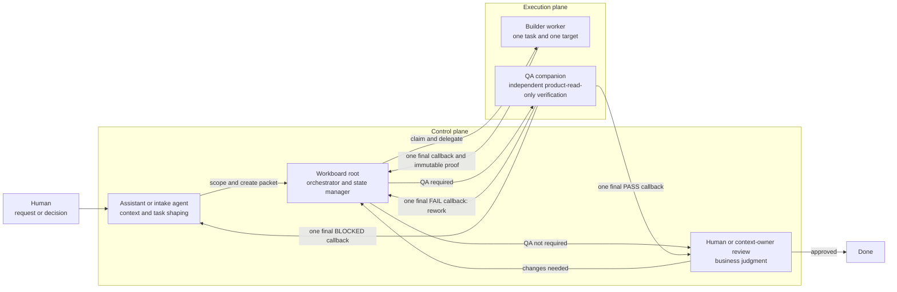

# Workboard Starter

A lightweight repo-based queue for coordinating agent work across local orchestrators and parallel worker threads.

Use it when your team has multiple projects, multiple agents, or long-running work that needs proof instead of vibes.

## What this is

Workboard is a shared filesystem/Git protocol:

1. Write a task packet in `tasks/ready/`.
2. A root orchestrator claims eligible work into `tasks/claimed/`.
3. The orchestrator delegates each packet to a correctly-scoped worker thread/project.
4. Each worker sends the persistent root task one final callback with immutable proof and the exact next lane.
5. Work that requires independent verification moves to `tasks/qa/` and a separate QA companion returns `PASS`, `FAIL`, or `BLOCKED`.
6. QA-passed work, or work that does not require QA, moves to `tasks/review/`.
7. A human or context owner checks the verified outcome and moves it to `tasks/done/`.

It does not require OpenClaw. It works with Codex Desktop, Claude Desktop, Claude Code, Codex CLI, OpenClaw, or any local agent that can read files, run commands, and use Git.

## How the roles fit together



These are responsibility boundaries, not necessarily different vendors or models. Keep each role in a separate task with the minimum context and permissions it needs:

- the assistant understands intent and business context;
- the root orchestrator owns queue state and routing;
- the builder changes one target project;
- the QA companion verifies fresh evidence without fixing or trusting the builder's conclusion;
- the human or context owner makes the final judgment.

## Why use it

Chat threads are bad source-of-truth. Workboard gives you:

- visible queue state;
- safe handoffs between humans and agents;
- parallel workers without losing the plot;
- per-target duplicate prevention without blocking unrelated work;
- proof requirements before “done”;
- blockers that survive context resets;
- a simple Git audit trail.

## Quick start

```bash
git clone <YOUR_WORKBOARD_REPO_URL> workboard
cd workboard
cp projects.example.yaml projects.yaml
mkdir -p tasks/{ready,claimed,qa,blocked,review,done}
git add projects.yaml tasks/*/.gitkeep
git commit -m "Configure local workboard"
```

Edit `projects.yaml` with your local project paths and the agent surface you use for each project.

Then copy the template:

```bash
cp templates/task-packet.md tasks/ready/$(date +%Y-%m-%d)-001-example-task.md
```

Fill it in, commit, push, and let your orchestrator run the loop.

## The mental model

The root orchestrator is air traffic control. It should:

- inspect the board;
- claim only safe, independent tasks;
- route each task to the right worker/project;
- treat active work as per-target locks;
- reconcile one-shot completion callbacks;
- record proof;
- stop at blockers.

Workers are pilots. Each worker gets one packet, one target path, and clear proof requirements.

Ordinary polls never inspect, monitor, heartbeat, or babysit active task history.
Claimed and active-QA packets consume capacity and lock their exact decoded
`target_project_id` + `target_path` tuple. Ready work for other targets keeps
routing up to capacity. Every builder and QA task receives the persistent source
`root_task_id`, canonical `worker_thread_id`, and persistent
`worker_creation_attempt_id`, then sends exactly one final callback. Only a
callback matching the packet's current task and attempt can route; delayed or
noncanonical callbacks are recovery evidence. Callback failure emits
`ROOT_RECONCILIATION_REQUIRED` with the same immutable proof and attempt ID.

QA companions are inspectors. They run as separate `[qa] <short label>` tasks inside the existing target project. They get the acceptance criteria, a pinned commit or immutable artifact, the required verification tools, and a local artifact directory. They report `PASS`, `FAIL`, or `BLOCKED`; they do not quietly fix the builder's work.

Do not turn the root orchestrator into a roaming implementation agent. That is how boards become soup.

## Repo layout

```text
docs/
  orchestrator-protocol.md  # standing instructions for the root loop
  intake-guide.md           # how to write packets
  automation-examples.md    # Codex/Claude/OpenClaw patterns
  live-task-visibility.md   # app-native proof and portable fallback
  pending-improvements.md   # production hardening backlog for the starter
ORCHESTRATOR.md              # first file for the local root orchestrator
scripts/
  check-workboard-queue.mjs # read-only queue and checkout classifier
  check-workboard-target-lock.mjs # exact decoded target-lock check
  check-workboard-callback.mjs # canonical callback identity/role/lane check
skills/
  workboard-orchestrator/    # optional portable skill instructions
templates/
  task-packet.md            # copy this into tasks/ready/
tasks/
  ready/                    # ready to claim
  claimed/                  # active work
  qa/                       # implementation-complete, independent QA pending/active
  blocked/                  # blocked with reason/proof
  review/                   # QA-passed or QA-not-required, final review pending
  done/                     # verified complete
projects.example.yaml       # copy to projects.yaml and customize
tests/
  check-workboard-callback.test.mjs
  check-workboard-queue.test.mjs
  check-workboard-target-lock.test.mjs
  live-task-visibility-docs.test.mjs
```

## Queue-first check

Before loading project registries, packet bodies, or task history, run the
dependency-free classifier:

```bash
node scripts/check-workboard-queue.mjs --repo "$PWD" --capacity 3
```

It does not fetch, merge, rebase, push, move packets, create directories, or
write automation memory. It reports checkout safety, queue counts, claimed and
active-QA target locks, completed QA results, configured/available capacity,
and one routing status. Capacity defaults to 3; at capacity it reports
`WORK_IN_PROGRESS` even when ready work is waiting. Run its tests with:

```bash
node --test tests/*.test.mjs
```

When ready work and active locks coexist, check each candidate with:

```bash
node scripts/check-workboard-target-lock.mjs \
  --target-project-id "$TARGET_PROJECT_ID" \
  --target-path "$TARGET_PATH" \
  --claimed-locks "$CLAIMED_LOCKS" \
  --qa-active-locks "$QA_ACTIVE_LOCKS"
```


## Tool requirements in task packets

When a task needs browser automation, computer use, Google Drive/Docs, screenshots, or another plugin/skill, declare it in the packet metadata instead of hoping the worker remembers.

Supported fields in `templates/task-packet.md` include:

- `requires_browser`
- `requires_computer_use`
- `requires_google_drive`
- `requires_google_docs`
- `requires_screenshot`
- `required_skills`
- `qa_required`
- `qa_status`
- `github_pr`, `github_issue`, `root_task_id`, and canonical `worker_thread_id`
- worker task title, creation surface/attempt ID, portable session ID, link, host identity, visibility status/proof, recovery status/pending, callback envelope, and routing blocker fields
- `qa_publish_to_github`, `qa_worker_notification_policy`, and publication receipt fields
- `qa_codex_project`
- `qa_model`
- `qa_artifacts_dir`
- `qa_thread_id`
- `qa_result`
- persistent `root_task_id`, canonical `worker_thread_id`, and per-creation `worker_creation_attempt_id`
- completion callback task/attempt identity, receipt, and error fields

The orchestrator must preflight these before delegation and require proof before routing the packet to `tasks/qa/` or `tasks/review/`.

## Minimum rules

- No secrets in this repo.
- No raw private memory dumps.
- One root orchestrator loop at a time.
- Default max active claimed or active-QA tasks: 3.
- One worker per packet.
- Claimed and active-QA packets lock only their exact target tuple; unrelated targets continue up to capacity.
- Active workers are event-driven: no periodic history reads, monitoring, or heartbeats.
- Each builder/QA task sends exactly one final callback to persistent `root_task_id`. Only callback `worker_task_id` matching canonical `worker_thread_id` and matching `worker_creation_attempt_id` can route; noncanonical callbacks are recovery evidence. Callback failure emits `ROOT_RECONCILIATION_REQUIRED`.
- QA runs in a separate task and does not inherit the builder's conclusions as truth.
- Every task title starts with its current Workboard state, including `[claimed]`, `[qa]`, `[review]`, and `[blocked]`.
- Workers do not spawn workers unless a packet explicitly allows a bounded read-only swarm.
- Unknown project/path means block and ask, not guess.
- Done requires proof.
- Desktop delegation requires live app-native list/read proof; persisted helper or session metadata alone is not visibility proof.
- An ambiguous app-native result keeps the source packet claimed, its exact target lock/capacity active, and duplicate routing forbidden until recovery resolves it.
- A packet moves to blocked and releases its lock only after recovery proves no usable/canonical worker remains and records the exact next action.
- Callbacks route only for the source packet's current canonical worker task ID and creation attempt ID. Hosts without app-native task APIs use the honest `portable_only` fallback, keep `worker_thread_id` empty, and return root reconciliation evidence instead of claiming canonical callback routing.

## First training exercise

1. Add one harmless task packet, such as “inspect this repo and suggest one README improvement.”
2. Have the root orchestrator claim it.
3. Start one worker in the Workboard project/path.
4. Have the worker write proof and route the packet to `tasks/qa/`.
5. Start a separate product-read-only QA task and record a `PASS`, `FAIL`, or `BLOCKED` result.
6. If the packet links a PR/issue, publish the concise QA result there and record the comment URL; otherwise follow the worker-notification fallback.
7. Route a pass to `tasks/review/`, inspect the result, and move it to `tasks/done/`.

That dry run teaches the whole loop without risking a real project.

## Key docs

Start here:

- `ORCHESTRATOR.md` — first-read instructions for the local root orchestrator
- `docs/orchestrator-protocol.md`
- `docs/intake-guide.md`
- `docs/automation-examples.md`
- `docs/live-task-visibility.md`
- `docs/pending-improvements.md`
- `templates/task-packet.md`
